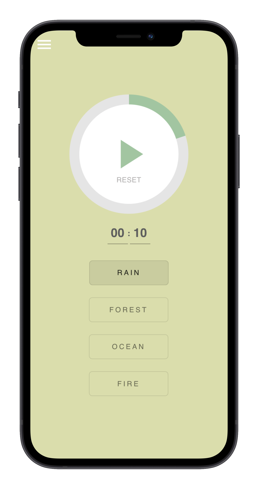
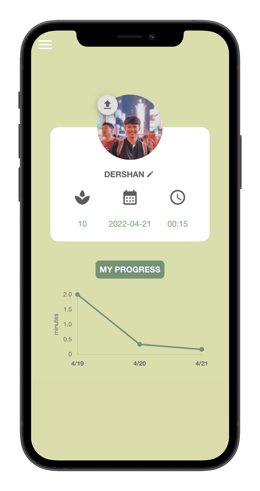

# Pace
## Motivation
Amidst all the stress invoked by schoolwork, internship search, and just life in general, it has been difficult, if not overwhelming for me to keep pace with everything that’s going on. Therefore, I hope to build an application that not only helps me get things done one by one, but also gives me some time to catch my breath and put my thoughts in order. Pace serves both as a productivity tool and a meditation timer, helping me pace myself more effectively.

## Features
* Interactive timer with clean interface and zero distractions
* Four preset soothing nature sounds (looking to add custom sounds in the future)
* Profile page that keeps track of your past sessions

  
  

## Installation
* Navigate to [https://andy-techen.github.io/pace/](https://andy-techen.github.io/pace/)
* Follow the steps for each device detailed [here](https://mobilesyrup.com/2020/05/24/how-install-progressive-web-app-pwa-android-ios-pc-mac/) to install the PWA and add it to your homepage
* Update your profile picture and username on the profile page
* Start timing and discovering your pace!